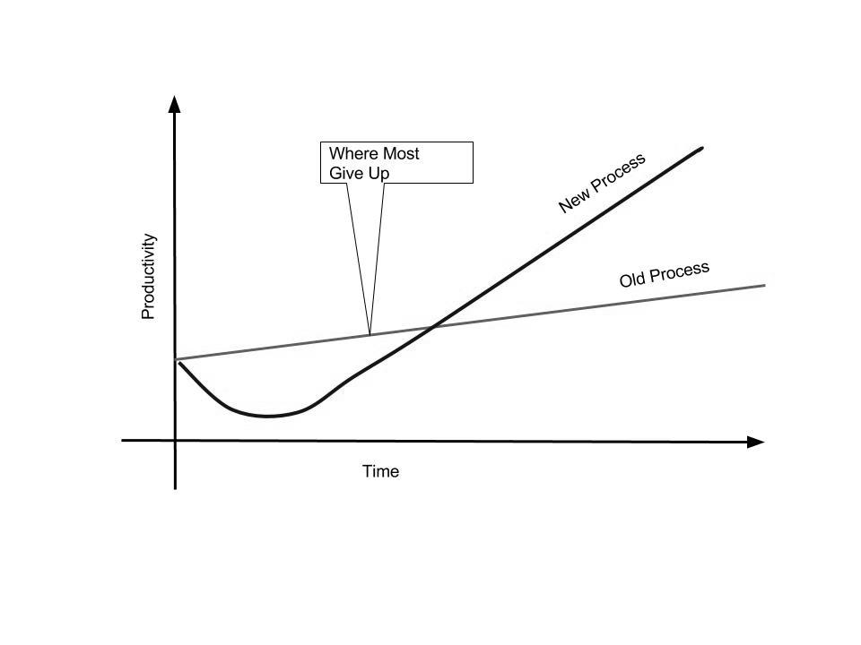

# Process

> The only 'best practice' you should be using all the time is 'Use Your Brain'.
>
>    *- Steven Robbins*

**Youngstar:** We're up to six people now.

**Graybeard:** Nice. Recruiting is hard.

**Youngstar:** You have no idea... Actually you do :)

**Graybeard:** Yeah, I've done my share of interviews.

**Youngstar:** But your interview methodology is flawed since I passed.

**Graybeard:** I'm labeling you as true positive.

**Youngstar:** That's a new one. Nice to be on the good side of the [confusion
matrix][confmat].

**Graybeard:** Do you see any changes once your size went up?

**Youngstar:** Oh yeah. Things look much more chaotic and seems like I spend too
much of my time ... not programming.

**Graybeard:** Sounds typical.

**Youngstar:** How can I beat typical and get to hacking?

**Graybeard:** It's called process.

**Youngstar:** I was looking into that. Agile, Scrum, XP, Lean, Kanban, CMMI,
... There are so many.

**Graybeard:** You know I didn't manage much - it cuts down my hacking time.

**Youngstar:** Yeah, but you trained many of your managers.

**Graybeard:** That I did. I'll give you some guidelines. The first thing is to
think about *why* do we need process.

**Youngstar:** To remove chaos?

**Graybeard:** Chaos is not all bad. I think it was Michael Crichton who said
that all functioning societies are somewhere between total stagnation and total
chaos.

**Youngstar:** Currently we're too much into the chaos side, some structure will
help.

**Graybeard:** There's a great article by Clay Shriky called ["A Group Is Its
Own Worst Enemy"][genemy]. Highly recommended.

**Youngstar:** I'll add it to my reading list.

**Graybeard:** Oh, we're going to fill this list today. One of the main points
in Clay's article is that in order for a group to function, individuals need to
do some sacrifices.

**Youngstar:** The same way I don't park my car in the middle of the road but in
a free parking spot?

**Graybeard:** Exactly. I see a process as set of rules that makes the group
function better. It's very important that your team members will understand it
and will see the benefit of the process. Otherwise it's just more red tape for
them..

**Youngstar:** OK. So process metrics should be visible?

**Graybeard:** Yes. And you should select the metrics carefully. People will try
to make them look good. For example if you measure number of bugs in production,
people won't write risky code.

**Youngstar:** What's good in risky code?

**Graybeard:** Sometimes it's the right solution. Even a good refactoring is
risky.

**Youngstar:** Pain vs gain again?

**Graybeard:** Yes, but we're digressing too much. Let's get practical now.

**Youngstar:** Practical is my middle name.

**Graybeard:** Didn't know you change it. Anyway ... Start with a light
process. Jared Spool said "Too much process is just like no process, except
slower."

**Youngstar:** And nobody likes red tape.

**Graybeard:** Yup. I've seen many teams, each has it's own process. It depends
on the team, the product, the culture and many other things. Most start with
[Scrum][scrum] since it's very light and flexible.

**Youngstar:** What's your variation?

**Graybeard:** It varies. The parts I tend to do are - sprint planning, morning
scrum, code reviews and retrospectives.

**Youngstar:** Sprint planning is where you decide on what to do this sprint?

**Graybeard:** Yes. It depends on the length of the sprint, I like one week
springs.

**Youngstar:** Do you leave spare time to unknowns?

**Graybeard:** If you have enough metrics, most of this unknowns will be "known
unknowns". People go on vacation, get sick, bugs in production, new customer
demo ... All of these are pretty predictable once you have enough data.

**Youngstar:** What about the "unknown unknowns"?

**Graybeard:** Deal with them when they happen. The hardest point is to make
management/product team understand that that's it - nothing else will get into
the sprint in that week.

**Youngstar:** What's called "feature creep"?

**Graybeard:** In part yes. OK, next thing are morning scrums, sometimes called
standups. I tend to do them late-ish so people will be there.

**Youngstar:** And so you can sleep late?

**Graybeard:** I exercise in the morning.

**Youngstar:** Oh right. If I recall correctly each member says what they did
yesterday, what they plan to do today and blockers.

**Graybeard:** Exactly. And you need to be very strict about keeping these
short. Technical solutions are not part of the standup. I had teams do the
standup in the chat room. This way you also have history of standups.

**Youngstar:** You love your chat rooms.

**Graybeard:** It's simple math. 1 to 1 communication is $$O(n^2)$$, where chat
room is $$O(n)$$. Add ["The Mythical Man-Month"][tmmm] to your reading list.

**Youngstar:** That old book?

**Graybeard:** 1975. But since it talks about people, and people haven't changed
much since 1975 - it's still very relevant.

**Youngstar:** OK. Next was code reviews. Anything special there?

**Graybeard:** Just make sure to do them. Allocate time for them in the process
and make sure they happen quickly.

**Youngstar:** Quickly since the code in the master branch drifts?

**Graybeard:** Yes. And also since the person who wrote the code moved to
another task and starts to forget.

**Youngstar:** And the last thing - retrospectives?

**Graybeard:** It comes from the old concept of [OODA loop][ooda].

**Youngstar:** OODA?

**Graybeard:** Observe, Orient, Decide, Act. But the most important part is the
loop. In retrospective you reflect on what you did and find out how to improve.
A lot of research on successful teams shows that this is a key practice. Sadly a
lot of teams skip it.

**Youngstar:** And you use "5 whys" in the retrospectives?

**Graybeard:** Up to you. The most common practice is to ask "what went well"
and these are things you keep. Then as "what went wrong" and these are parts you
need to improve.

**Youngstar:** Improve the process?

**Graybeard:** Yes, the process aim is to help the team work better. If it
doesn't do it - fix it.

**Youngstar:** Any tools you recommend?

**Graybeard:** A tool to track work is essential. There are many out there, free
or not, hosted or not. A lot of services that host code, such as
[github][github] provide simple issue system which is usually good enough.

**Youngstar:** What about `JIRA`?

**Graybeard:** JIRA is great and have excellent support and ecosystem. But I'd
start with something free and move there only if there's a need.

**Youngstar:** OK, what else?

**Graybeard:** Source control is a must, [git][git] seems to be the one most
people use today and it has a great tooling around it.

**Youngstar:** How's source control connected to process?

**Graybeard:** Help with collaboration. I work in a feature branch per
issue. Once the branch passes tests and code review - it is merged to master.

**Youngstar:** OK. 

**Graybeard:** You need a tool to review code.

**Youngstar:** github has it as well?

**Graybeard:** Yeah, and bitbucket, and gitlab, and ...

**Youngstar:** OK, OK ...

**Graybeard:** A tool that's a bit different is [gerrit][gerrit]. Apart from
code reviews, it also automatically merges code to master once you get enough
plus ones.

**Youngstar:** Plus one? As in the [Apache voting system][avote]?

**Graybeard:** Yes. Another tool I find essential is group chat.

**Youngstar:** Yeah, we talked on this already. Anything specific?

**Graybeard:** Both [Slack][slack] and [HipChat][hipchat] are nice and comes
with many bells and whistles. Internally companies usually install a
[Jabber](jabber) server. Oh, and don't forget IRC.

**Youngstar:** IRC? With the hashtags and AFK? It's still a thing?

**Graybeard:** Very much, it works and there's a lot tooling around it.

**Youngstar:** I'll start with hosted, save me operations.

**Graybeard:** I agree.

**Youngstar:** Any other tools?

**Graybeard:** A place for documentation. Most of the collaboration tools
mentioned earlier have a [Wiki][wiki] based system. Some companies use [Google
Docs][gdocs] or another online office suite.

**Youngstar:** I already have Google Docs since I use them for my email. They
also provide calendar and other tools.

**Graybeard:** Yup. Note they're not the only player, but they are a good
default choice. And again you save on operations.

**Youngstar:** Anything else?

**Graybeard:** I think that's pretty much it. Let's see... Start sprint and use
issue system. Code in branch and optionally update wiki, submit to code review.
Communicate in chat room and do retrospective in wiki with new issue... Oh, I
forgot [Jenkis][jenkins].

**Youngstar:** The [CI][ci] system?

**Graybeard:** Yes and much more. There's a joke: "I don't care if it works on
your machine, we're not shipping your machine."

**Youngstar:** Ha. I've seen this "works on my machine" too many times.

**Graybeard:** Another nice to have tool are all the bots in the chat room.
Google [chatops][chatops] to see what you can do with these bots. It's also a
lot of fun to write and use them.

**Youngstar:** And fun is important to keep people around.

**Graybeard:** Not to mention that you spend a lot of time at work, so it better
be fun... This reminds of another book.

**Youngstar:** Great.

**Graybeard:** It's called [Peopleware][peopleware].

**Youngstar:** Like hardware but for people?

**Graybeard:** Exactly. It's an excellent read. You reminded me of it by talking
about fun. In this book they talk how many companies don't calculate the price
of replacing an employee - with is very high.

**Youngstar:** Recruiting, training ...

**Graybeard:** Also most people are not at 100% until about a year at work.

**Youngstar:** Ouch!

**Graybeard:** Yup.

**Youngstar:** OK. Tomorrow I'll install a bunch of tools and make sure we have
fun. And be more productive.

**Graybeard:** It's all about the journey. Tell people it takes time to adopt a
new process. Show them this (draws on a napkin)

**Youngstar:** I see, good one.

**Graybeard:** Note that process is procedure. You've succeeded once it become
culture. Peter Drucker said "Culture Eats Strategy For Breakfast." When people
come to standup since this is the way we communicate and not since the boss told
them - that when you win.

**Youngstar:** Interesting ... This also affects hiring.

**Graybeard:** Very much. You need to think about the company you want to
create. I prefer places where everything is allowed unless explicitly forbidden.

**Youngstar:** Don't we all? I'll think on that on my journey home.

**Graybeard:** Oh, one more book for you.

**Youngstar:** You do deliver on your promises, which one is that?

**Graybeard:** It's called ["Getting Real"][greal]. You'll like the "meetings
are toxic" part of it.

**Youngstar:** Yes I will.

**Graybeard:** Alright, g'night and happy reading.

**Youngstar:** G'night.

I> ## TL;DR
I> * Start with light process.
I>     * Scrum is a good starting point
I> * Create a culture
I> * Fix the process, do retrospectives
I> * Use a chat room, add a nice bot to it
I> * Automate whatever you can
I> * Measure your process (metrics)
I> * Example process:
I>     * Sprint start: Pick issues for sprint
I>     * During sprint: Feature branches, code review, communicate in chat room,
I>       CI with Jenkins. No new issues during sprint, morning standups
I>     * After sprint: retrospective which yields new issues

[avote]: http://www.apache.org/foundation/voting.html
[chatops]: http://blogs.atlassian.com/2016/01/what-is-chatops-adoption-guide/
[ci]: https://www.thoughtworks.com/continuous-integration
[confmat]: https://en.wikipedia.org/wiki/Confusion_matrix
[gdocs]: https://www.google.com/docs/about/
[genemy]: http://www.shirky.com/writings/herecomeseverybody/group_enemy.html
[gerrit]: https://www.gerritcodereview.com/
[git]: https://git-scm.com/
[github]: https://github.com
[greal]: https://gettingreal.37signals.com/
[hipchat]: https://www.hipchat.com/
[jabber]: http://www.jabber.org/
[jenkins]: https://jenkins.io/index.html
[ooda]: https://en.wikipedia.org/wiki/OODA_loop
[peopleware]: http://www.amazon.com/Peopleware-Productive-Projects-Second-Edition/dp/0932633439
[scrum]: https://en.wikipedia.org/wiki/Scrum_(software_development)
[slack]: https://slack.com/
[tmmm]: https://en.wikipedia.org/wiki/The_Mythical_Man-Month
[wiki]: https://en.wikipedia.org/wiki/Wiki
